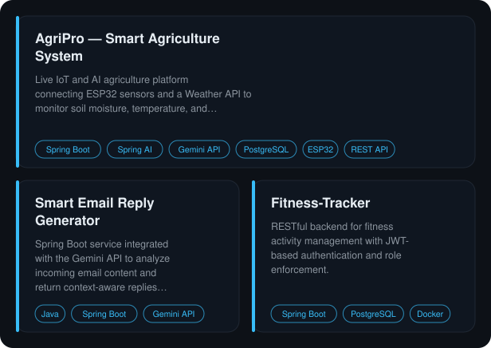
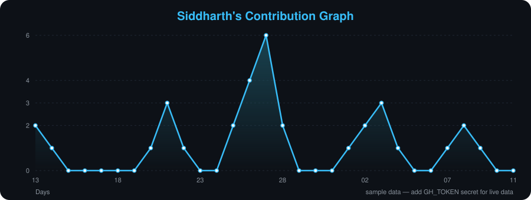

<!--
  AUTO-GENERATED FILE — do not edit directly.
  Edit config.yml instead; this file is rebuilt by the GitHub Action
  (.github/workflows/update-profile.yml) on every push and on a daily
  schedule, so contribution/skills data stays current.
-->

Backend engineer focused on integrating AI models into production systems. Built AgriPro, a live IoT and AI agriculture platform using Spring AI with dynamic prompt engineering to generate context-aware crop recommendations and disease treatment guidance from real-time sensor data. Comfortable across the stack — API design, authentication, database modeling, and containerized deployment — with a Spring Boot and REST API core.

 

 

## About

- B.Tech in Computer Science and Engineering, Gautam Buddha University, Greater Noida (2022 – 2026)
- Based in Greater Noida, UP, India
- Core strength is Java backend development — Spring Boot, Spring Data JPA, Spring Security, REST API design, JWT/OAuth authentication
- Hands-on experience integrating AI into backend systems: Spring AI, prompt engineering, structured JSON output, and image-based inference
- Comfortable across the stack when needed — REST API consumption, IoT device integration, and containerized deployment
- Built and shipped AgriPro, a live IoT + AI agriculture platform, from sensor ingestion through to AI-generated recommendations

 

## Skills Radar

 

## Tech Stack

<table>
<tr>
<td valign="top" width="33%">

**Languages**

    
</td>
<td valign="top" width="33%">

**Backend & Frameworks**

       
</td>
<td valign="top" width="33%">

**AI & ML Integration**

    
</td>
</tr><tr><td valign="top" width="33%">

**Databases**

  
</td>
<td valign="top" width="33%">

**Tools & DevOps**

       
</td>
</tr>
</table>

 

## Featured Projects

### AgriPro — Smart Agriculture System
Live IoT and AI agriculture platform connecting ESP32 sensors and a Weather API to monitor soil moisture, temperature, and humidity in real time, with AI-generated crop and disease guidance.

**Stack:** Spring Boot, Spring AI, Gemini API, PostgreSQL, ESP32, REST API

**Highlights:**
- Integrated Spring AI with dynamic prompt engineering for context-aware crop recommendations and disease treatment guidance from live sensor and weather data
- Built a crop disease detection module that accepts image uploads, returns a confidence score, and delivers AI-generated treatment suggestions
- Designed 4 RESTful endpoints for sensor ingestion, crop recommendation, and disease detection, with validation, error handling, and pagination
- Implemented a tri-state irrigation alert system (OK / WARNING / CRITICAL) with automated email notifications and cooldown logic

[Repository](https://github.com/Siddharth-del/Smart-Agriculture-System-Frontend) &nbsp;·&nbsp; [Live Demo](https://agripro-ai.vercel.app/)
 

### Smart Email Reply Generator
Spring Boot service integrated with the Gemini API to analyze incoming email content and return context-aware replies as structured JSON.

**Stack:** Java, Spring Boot, Gemini API, REST API

**Highlights:**
- Designed prompt templates to improve reply relevance and keep output formatting consistent across email types
- Implemented request validation and error handling for stable communication with the AI model

[Repository](https://github.com/Siddharth-del/Smart-Email-Reply-Generator)
 

### Fitness-Tracker
RESTful backend for fitness activity management with JWT-based authentication and role enforcement.

**Stack:** Spring Boot, PostgreSQL, Docker, JWT

**Highlights:**
- Integrated PostgreSQL with optimized entity relationships, deployed to Neon Cloud
- Containerized with Docker and set up a CI/CD pipeline for automated deployments
- Validated all endpoints using Postman and ReadyAPI across 15+ API routes

[Repository](https://github.com/Siddharth-del/Fitness-Tracker)
 

 

## Contribution Activity

 

## Certifications

- Java with Data Structures & Algorithms — PW Skills
- Java Spring Boot Full Stack eCommerce Project Masterclass — Udemy, April 2026

 

## Currently Learning

- Advanced Spring AI and prompt engineering patterns
- Retrieval-Augmented Generation (RAG) and vector databases
- Microservice architecture and system design
- Cloud deployment and CI/CD practices

 

## Connect

 

*Building scalable backend systems and exploring the intersection of Java, AI, and intelligent applications.*

